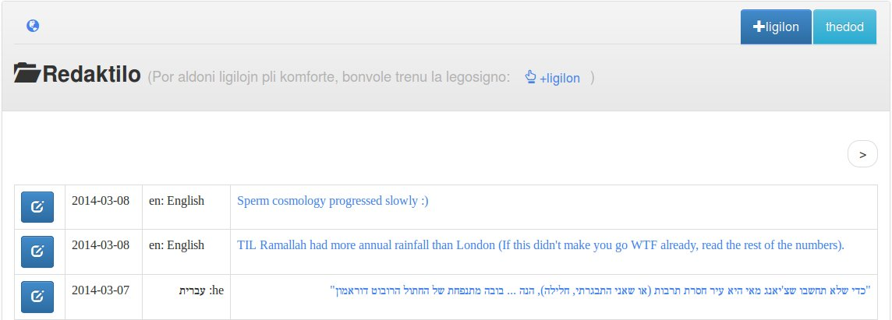

`Ligiloj` (`links` in Esperanto) is a minimalistic multilingual microblogging app. Possible uses can be:

* An [artist](http://etgarkeret.com) who has fans (and gets coverage by media) speaking several languages.
* Coordination of a global event (e.g. "buy nothing day").
* Even a personal micro blog ([**see demo**](https://swatwt.com/favs)),
  if you and your friends speak more than a single language
  (this is true for most non-English-speakers on the internet, BTW :p ).

Ligiloj tries to make it easier for admins to deal with items in languages they don't understand, so things are deliberately dumbed-down to the max:

  * "Posts" don't have bodies, only titles (similar to tweets).
  * Admins have a bookmarklet that copies the page title into a form they can manually edit [if needed] and post.

### Language barriers can be fun

In order to equally share that special "surfing while foreigner" feeling English speakers are usually deprived of,
the language of the user interface is Esperanto (It's OK. I don't understand it either ;) ).
Fear not. There are icons, you can use online translation services, deal with it like most of the world does ;)

### RSS (or, look what we've done to his song. Duh)
There are RSS feeds at `/rss`[`/<lnaguage code>`]. You browser may not remember how to show this to you (et tu, Mozilla?),
but there are many ways to [integrate](https://codex.wordpress.org/WordPress_Widgets#Using_RSS_Widgets)
[RSS](http://offog.org/code/rawdog/) [server](http://www.planetplanet.org/) [side](http://wordpress.org/plugins/search.php?q=rss+widget&sort=),
[aggregate](http://lifehacker.com/the-best-news-reader-application-for-android-5807863) it
[on](https://github.com/ahorn/android-rss)
[phones](http://www.macworld.com/article/1140310/rssreaders.html),
and do all those federated and p2p things @AARONSW enabled us to do with information
(not what we've [ended](https://en.wikipedia.org/wiki/Behavioral_targeting) [up](https://www.eff.org/nsa-spying) doing with it).

### Install/config:

* To install the `lg_authority` submodule: `git submodule update --init`
* To install other dependencies: `pip install -r requirements.txt`
* To create an initial `cherrypy.config`: `./makeconfig`. (also creates the dumb but useful `appdir.conf`)
* To initialize the db and load language deinitions: `python models.py` (say `y` at the prompt).

### Run:

* `python server.py`

### Manage users:

Authentication is done via `lg_authority`. It can do a lot, but here's what it does
"out of the box":

* Go to `/login` and login as `admin/admin` (lame).
* Change password (of course).
* Create some other user. The password will be `password` (lamer)
  and admin can't change it - you have to login as that user for that (lameroo galore).

At the moment, the app ignores groups and allows all authenticated users to edit the db
(the `admin` group is significant, though: `lg_authority` allows `admin` members to manage users).

### Customizing the GUI

Out-of-the-box, Ligiloj comes with a responsive gui (so it can nicely fit into an iframe).

An easy way to give the gui a unique[-ish] look is to [customize](http://getbootstrap.com/customize/)
[bootstrap.min.css](static/assets/css/bootstrap.min.css) (or simply use [prefab bootstrap themes](http://bootswatch.com) like I do).
Note that there's no JS in the templates &mdash; the easiest way to be *no-js* friendly ;)

If you want to do things differently (yes JS, no bootstrap, etc.), the [templates/](templates/) folder contains 3 easy-to-tweak [mustache](http://mustache.github.io/) templates.
